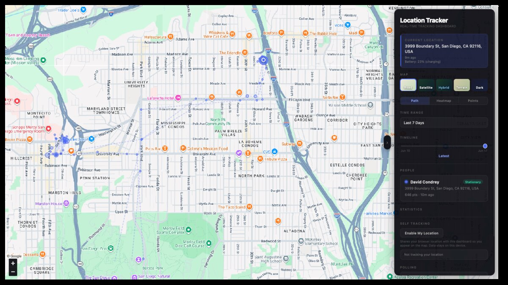
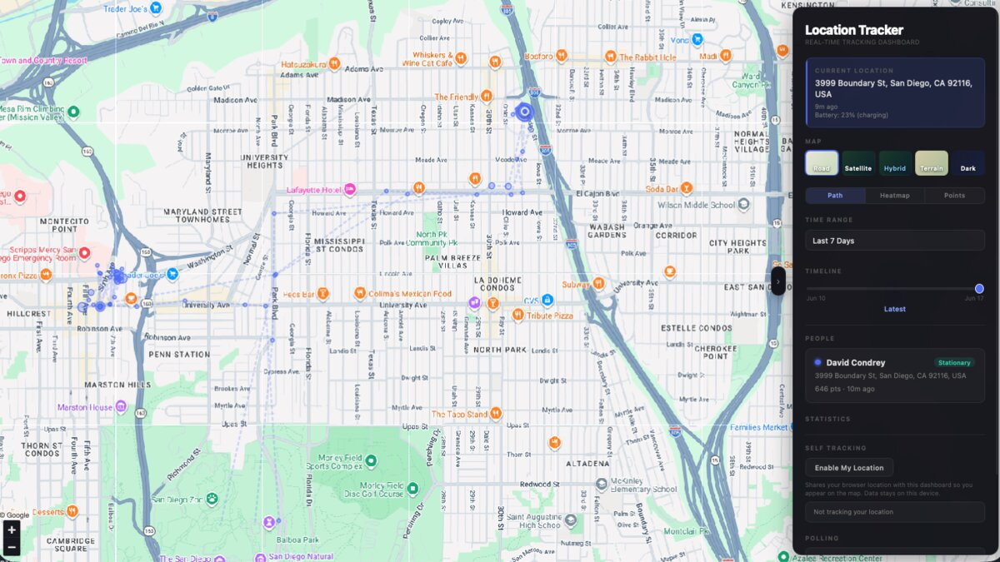
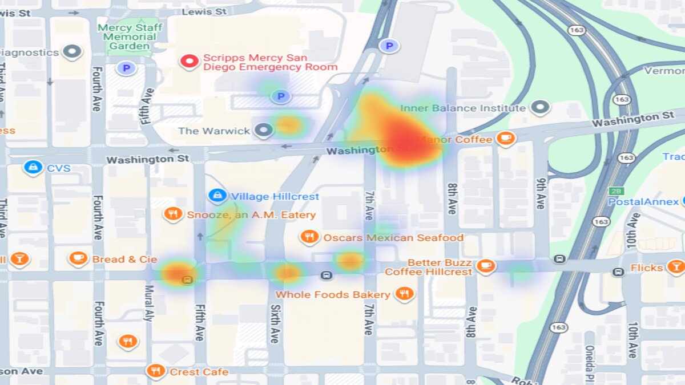
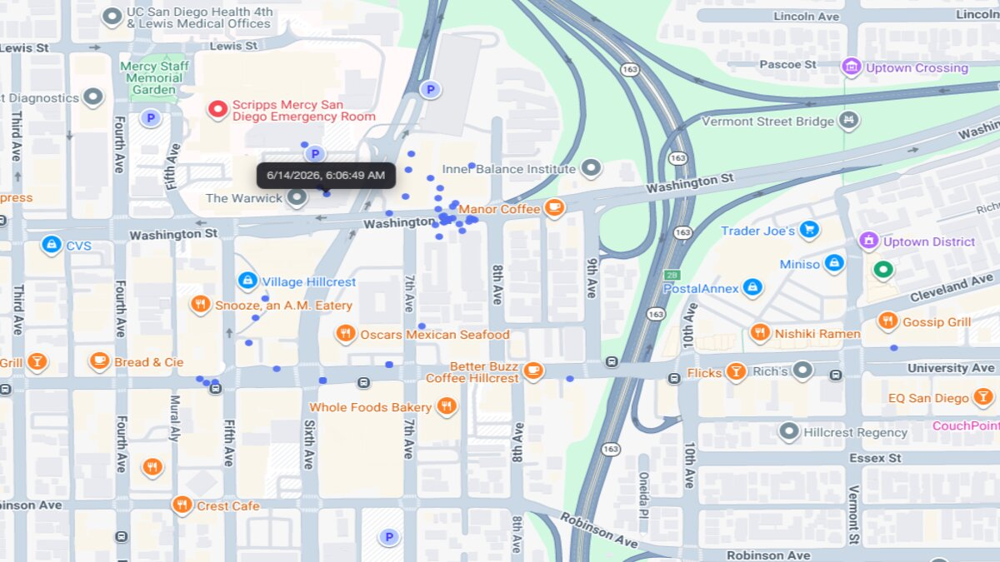

# Location Tracker
[](https://github.com/dcondrey/location-tracker/actions/workflows/ci.yml)
[](LICENSE)
[](https://www.python.org)


A self-hosted location tracking dashboard that polls Google Maps location sharing and visualizes movement history on an interactive map. Features intelligent learning-based polling, geofencing, road snapping, and route corridor prediction. Runs as a background daemon with a real-time web interface.

## Screenshots

| Path View | Terrain View |
|:---------:|:------------:|
|  |  |

| Heatmap | Points |
|:-------:|:------:|
|  |  |

## Install

### From PyPI

```bash
pipx install location-tracker
# or
uv tool install location-tracker
```

### From source

```bash
git clone https://github.com/dcondrey/location-tracker.git
cd location-tracker
./setup.sh
```

### Manual setup

```bash
uv sync
uv run location-tracker setup
```

### Docker

Docker runs the tracker without installing Python on the host. The container includes Playwright Chromium. Cookie sign-in uses a temporary noVNC browser session, and the tracker stores its database and encrypted cookies in Docker volumes.

1. Create `.env` in the project directory:

```env
LOCATION_TRACKER_EMAIL=you@gmail.com
```

Use the Google account that has access to Location Sharing.

2. Build the image:

```bash
docker compose build
```

3. Capture Google cookies:

```bash
docker compose --profile cookies run --rm --service-ports cookies
```

Keep that terminal open. In your browser, open:

```text
http://localhost:6080/vnc.html
```

Click **Connect**. There is no VNC password. A Chromium window will open inside the noVNC desktop. Sign in to Google and let Google Maps load. The encrypted cookie file, browser profile, database, and Docker encryption key are stored in the `tracker-data` volume.

After sign-in completes and Google Maps loads, close the Chromium window inside noVNC. The cookie command will then extract cookies from the saved browser profile and write the encrypted `cookies.enc` file. If the command exits successfully, authentication is ready.

4. Start the tracker:

```bash
docker compose up -d
```

5. Open the dashboard:

```text
http://localhost:7070
```

Useful Docker commands:

```bash
docker compose logs -f tracker
docker compose down
docker compose --profile cookies run --rm --service-ports cookies
```

Run the `cookies` command again whenever Google cookies expire. If the tracker is already running, stop it first so the browser profile is not used by two processes at once:

```bash
docker compose stop tracker
docker compose --profile cookies run --rm --service-ports cookies
docker compose up -d tracker
```

Docker persistence:

| Volume | Container path | Contents |
|--------|----------------|----------|
| `tracker-data` | `/home/location/.local/share/location-tracker` | SQLite database, encrypted cookies, browser profile, encryption key |
| `tracker-config` | `/home/location/.config/location-tracker` | Tracker config |

By default, Docker stores the Fernet cookie-encryption key at `/home/location/.local/share/location-tracker/cookie-encryption.key` inside `tracker-data`. To supply your own key instead, add `LOCATION_TRACKER_FERNET_KEY` to `.env`.

To delete all Docker-stored tracker data and start over:

```bash
docker compose down -v
```

Docker users do not need Python, uv, macOS Keychain, or launchd on the host. Docker Desktop or Docker Engine with Compose is enough.

## Getting Started

```bash
# 1. Set your Google account email
location-tracker config --email you@gmail.com

# 2. One command does everything: install browser, configure DNS, authenticate, start, and open dashboard
location-tracker setup
```

That's it. The setup command installs Chromium, configures `tracker.local` in `/etc/hosts`, opens a browser for Google sign-in, encrypts the cookies, starts the daemon, and opens the dashboard automatically.

The dashboard runs at **http://tracker.local**. Flask listens on port 7070; macOS packet filter forwards port 80 transparently. If the hostname doesn't resolve, use `http://localhost:7070`.

## Prerequisites

- **Python 3.11+**
- **macOS** (uses Keychain for cookie encryption, launchd for persistence)
- **uv** package manager ([install](https://docs.astral.sh/uv/getting-started/installation/))
- A Google account with [location sharing](https://support.google.com/maps/answer/7326816) enabled

<details>
<summary><strong>Features</strong> -- adaptive polling, geofencing, WiFi fingerprinting, dashboard, ML anomaly detection</summary>

- **Intelligent adaptive polling** -- Distance-based spacing with learned behavior patterns; 4s when arriving, progressive backoff when stationary
- **Interactive dashboard** -- Dark-themed Leaflet map with path visualization, heatmaps, stop detection, and timeline scrubbing
- **Place learning** -- Automatically clusters frequent stops into known places, predicts dwell time and departure probability
- **Geofencing** -- Define geographic boundaries with enter/exit event notifications
- **Road snapping** -- Local coordinate-to-road snapping for cleaner path visualization
- **Route corridors** -- Learns travel patterns between known places, predicts destinations and trip durations
- **Self-tracking** -- Track your own position via browser geolocation (requires HTTPS or localhost)
- **Encrypted cookie storage** -- Google auth tokens encrypted at rest with Fernet, key stored in macOS Keychain
- **Auto cookie refresh** -- Headless browser automatically re-authenticates when cookies expire
- **Battery-aware** -- Reduces poll frequency when the tracked device's battery is low
- **SQLite storage** -- Location history stored in an indexed SQLite database with WAL mode
- **Mobile responsive** -- Bottom-sheet sidebar on phones, touch-friendly controls
- **Multiple export formats** -- JSON, CSV, and GeoJSON
- **Persistent daemon** -- Optional launchd integration to survive reboots
- **CLI query tools** -- Look up anyone's latest location or history from the terminal
- **Provider-agnostic** -- Extensible provider architecture; currently supports Google Maps location sharing

</details>

<details>
<summary><strong>Commands</strong> -- tracking, auth, config, service management, querying, geofencing</summary>

### Tracking

| Command | Description |
|---------|-------------|
| `on` | Start the tracker daemon and web dashboard |
| `off` | Stop the tracker |
| `status` | Check if the tracker is running |

### Authentication

| Command | Description |
|---------|-------------|
| `cookies` | Open browser to authenticate with Google |
| `test` | Verify cookies are valid and list shared contacts |

When cookies expire, the tracker automatically attempts a headless browser refresh using the saved browser profile. If that fails (e.g. Google requires re-login), it logs an error and you re-run `location-tracker cookies`.

### Configuration

| Command | Description |
|---------|-------------|
| `config --email you@gmail.com` | Set the Google account email |
| `config --port 7070` | Set the dashboard port |
| `config --hostname tracker.local` | Set the custom hostname |
| `config --poll-interval 600` | Set the default poll interval (seconds) |
| `config` | Show current configuration |
| `setup` | Full setup: install browser, DNS, authenticate, start, and open dashboard |

### Service Management

| Command | Description |
|---------|-------------|
| `install` | Install as a launchd service (auto-start on login) |
| `uninstall` | Remove the launchd service |
| `dns` | Manually set up `http://tracker.local` hostname |
| `dns-remove` | Remove custom hostname |

### Querying Data

| Command | Description |
|---------|-------------|
| `where <person>` | Show someone's latest known location |
| `history <person> --days 7` | Show recent location history (last 20 entries) |
| `stats` | Print tracking statistics (distance, stops, dwell time) |
| `map --days 7 --output map.html` | Generate a static HTML map |
| `purge <days>` | Delete location records older than N days |

### Geofencing

| Command | Description |
|---------|-------------|
| `geofence add <person> <label> <lat> <lon> [--radius]` | Create a geofence |
| `geofence list` | List active geofences |
| `geofence remove <id>` | Remove a geofence by ID |
| `geofence events` | Show recent geofence enter/exit events |

</details>

<details>
<summary><strong>Dashboard</strong> -- map layers, visualization modes, timeline scrubber, export</summary>

The web dashboard at `http://tracker.local` provides:

- **Map layers** -- Road, Satellite, Hybrid, and Terrain via Google tiles
- **Visualization modes** -- Path (color-coded routes with stop nodes), Heatmap, and Points
- **Road snapping** -- Snaps tracked coordinates to nearby roads for cleaner path traces
- **Time filtering** -- 24h, 3 days, 7 days, 30 days, 90 days, or all time
- **Timeline scrubber** -- Drag to view historical positions; shows date/time labels
- **Person cards** -- Click to focus; shows speed badge (Stationary/Walking/Driving/Highway)
- **Self-tracking** -- Enable browser geolocation to appear on the map
- **Poll status** -- Live display of current polling interval, speed category, and error state
- **Export** -- Download data as JSON, CSV, or GeoJSON
- **Toast notifications** -- Visual feedback for all actions
- **Mobile layout** -- Bottom-sheet sidebar on screens under 640px

</details>

<details>
<summary><strong>How It Works</strong> -- adaptive polling, intelligence engine, cookie lifecycle, security, data storage</summary>

### Intelligent Adaptive Polling

The tracker uses distance-based spacing combined with learned behavior patterns to determine poll frequency. Instead of fixed intervals per speed tier, it calculates the optimal interval to maintain consistent spatial resolution along the tracked path.

**When moving:**

| Condition | Poll Interval | Strategy |
|-----------|--------------|----------|
| Departing (accelerating < 15 km/h) | 6 seconds | Capture departure path |
| Arriving (decelerating < 20 km/h) | 5 seconds | Capture arrival path |
| Highway (> 60 km/h) | ~15 seconds | 500m spacing |
| Driving (10-60 km/h) | 15-25 seconds | 200m spacing |
| Walking (1-10 km/h) | 25-60 seconds | 50m spacing |

**When stationary:**

| Condition | Poll Interval | Strategy |
|-----------|--------------|----------|
| Just stopped (< 2 min) | 20 seconds | Detect if movement resumes |
| Recently stopped (2-10 min) | 90 seconds | Settling down |
| Settled (10-30 min) | 4 minutes | Monitoring |
| Long stationary (> 30 min) | 10 minutes | Conserve resources |
| At known place with dwell prediction | Adaptive | Based on predicted remaining time |
| High departure probability (> 60%) | 8 seconds | Pre-position for departure |

**Battery-aware adjustments:** When the tracked device's battery is low, poll intervals are multiplied (1.5x at 15-30%, 2.5x at 5-15%, 5x below 5%) to reduce drain. Charging devices are unaffected.

### Intelligence Engine

The tracker learns from observed patterns to improve predictions over time:

- **Place clustering** -- Frequent stops are automatically grouped into "known places" with adaptive radii and visit counts
- **Dwell prediction** -- Predicts how long someone will remain at a known place based on historical visit durations, weighted by day-of-week and time-of-day
- **Departure probability** -- Estimates the likelihood of imminent departure using historical departure times at each place
- **Speed zone detection** -- Learns locations where vehicles typically decelerate (turns, intersections) and increases poll frequency when approaching them
- **Route corridors** -- Records trips between known places with duration and distance, predicts likely destinations and trip times
- **Observation decay** -- Old data (> 90 days) is automatically pruned; recent data weighted via a 14-day half-life

### Cookie Lifecycle

1. **Capture**: `location-tracker cookies` opens a Chromium browser to Google sign-in. Cookies are detected automatically when login completes (supports MFA, 15-minute timeout).
2. **Encryption**: Cookies are encrypted with `cryptography.Fernet` and saved as `cookies.enc`. The encryption key is stored in macOS Keychain, never on the filesystem.
3. **Usage**: On each poll, cookies are decrypted to a temporary file, passed to the API, then the temp file is deleted.
4. **Expiry**: When Google rejects the cookies, the tracker attempts an automatic headless refresh using the persistent browser profile. If the Google session is still valid, fresh cookies are captured without user interaction. If not, the tracker logs an error and continues polling at the default interval until you re-run `location-tracker cookies`.

### Security

- **Encrypted at rest** -- Auth cookies encrypted with Fernet; key in macOS Keychain
- **Localhost only** -- Flask binds to `127.0.0.1`; not accessible from the network
- **XSS protection** -- All user-controlled data HTML-escaped before rendering
- **Input validation** -- Lat/lon bounds checking on all coordinate inputs
- **Atomic storage** -- SQLite with WAL mode for concurrent read/write safety
- **No plaintext secrets** -- Plaintext `cookies.txt` auto-migrated and deleted on first run

### Data Storage

Location history is stored in a local SQLite database (`location_history.db`) with indexed columns for person, timestamp, and compound queries. Existing `location_history.json` files are automatically migrated on first run.

Use `location-tracker purge <days>` to enforce a retention policy.

</details>

<details>
<summary><strong>API Endpoints</strong> -- locations, stats, polling, export, geofences</summary>

The dashboard exposes these local API endpoints (also available under `/api/v1/`):

| Method | Path | Description |
|--------|------|-------------|
| GET | `/api/locations?days=7` | Location history with per-person speed info |
| GET | `/api/stats` | Tracking statistics per person |
| GET | `/api/poll-status` | Current polling interval, speed category, and error state |
| GET | `/api/health` | Database health check and recent poll history |
| GET | `/api/export?format=json` | Export all data (json, csv, geojson) |
| POST | `/api/self-location` | Submit browser geolocation |
| POST | `/api/snap` | Road-snap a coordinate trace |
| GET | `/api/geofences?person=Name` | List geofences for a person |
| POST | `/api/geofences` | Create a new geofence |
| GET | `/api/geofence-events?person=Name` | List geofence enter/exit events |
| POST | `/api/geofence-events/acknowledge` | Acknowledge all geofence events |

</details>

<details>
<summary><strong>Project Structure</strong></summary>

```
location-tracker/
  main.py            # CLI entry point and daemon management
  tracker.py         # Location polling, stats, and static map generation
  dashboard.py       # Flask web server, API endpoints, and background poll loop
  intelligence.py    # Learning engine: place clustering, dwell prediction, route corridors
  road_snap.py       # Local coordinate-to-road snapping
  db.py              # SQLite database layer
  providers.py       # Location provider abstraction (Google Maps)
  cookie_store.py    # Encrypted cookie storage (Fernet + Keychain)
  get_cookies.py     # Browser-based Google authentication
  templates/
    index.html       # Dashboard HTML
  static/
    style.css        # Dashboard styles (dark theme, mobile responsive)
    app.js           # Dashboard JavaScript (Leaflet map, real-time updates)
  tests/
    test_db.py       # Database layer tests
    test_tracker.py  # Tracker logic tests
    test_dashboard.py # Dashboard function tests
    test_intelligence.py # Intelligence module tests
  setup.sh           # One-command install script
  build.sh           # PyInstaller standalone build
```

</details>

<details>
<summary><strong>Data Directory</strong></summary>

All data is stored in `~/.local/share/location-tracker/`:

| File | Purpose |
|------|---------|
| `location_history.db` | SQLite database with all location records |
| `cookies.enc` | Encrypted Google auth cookies |
| `browser_profile/` | Persistent Chromium browser profile for cookie refresh |
| `tracker.log` | Daemon log file (rotated at 10MB) |

Config is stored in `~/.config/location-tracker/config.json`.

</details>

## Troubleshooting

**http://tracker.local doesn't load**:
- Check DNS: `ping tracker.local` should resolve to 127.0.0.1
- Check daemon: `location-tracker status`
- Check port forwarding: `sudo pfctl -sn` should show the rdr rule
- Try direct port: `http://localhost:7070`
- Re-run setup: `location-tracker setup`

**"Cookies expired" errors**:
- The tracker auto-refreshes cookies headlessly when possible
- If auto-refresh fails, re-run: `location-tracker cookies`

**"No cookies found" on first start**:
- Run `location-tracker setup` which handles everything

**Self-tracking says "Requires HTTPS or localhost"**:
- Browser geolocation requires a [secure context](https://developer.mozilla.org/en-US/docs/Web/Security/Secure_Contexts)
- Access via `http://localhost:7070` instead of `http://tracker.local`

**Polling shows "error: auth"**:
- Google cookies have expired; run `location-tracker cookies` to re-authenticate

**Polling shows "error: network"**:
- Check internet connectivity; the tracker will retry with exponential backoff

## Contributing

See [CONTRIBUTING.md](CONTRIBUTING.md) for development setup, code style, and areas where help is wanted.

## License

MIT
